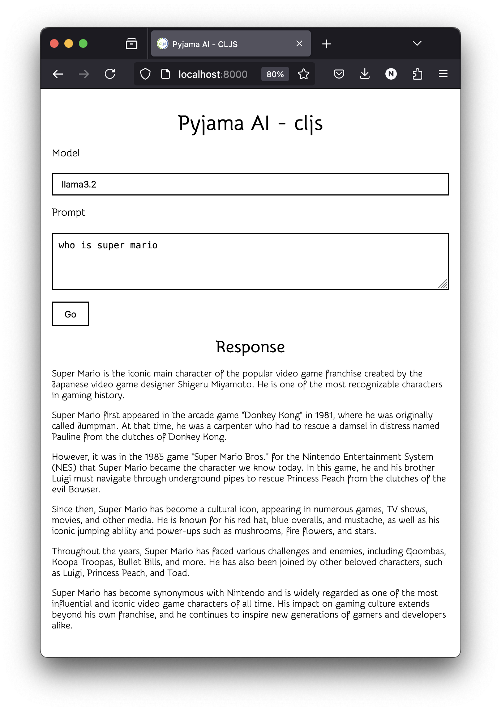

Quick Prototype to get pyjama to run in the browser

# Screenshots



# Getting Started

## Clojure Part

```bash
# requires npm
npm install 
# needed ?
clojure -M:shadow-cljs npm-deps
# requires npx
npx shadow-cljs watch app
```

## Nginx on docker

This is needed to set up the CORS parameters to access Llama

```
cd nginx
./stop.sh && ./build.sh && ./start.sh
```

## Start HTTP server and Navigate 

No need to start a http server, shadow-cljs already includes one.

[http://localhost:8000](http://localhost:8000)

## DeepSeek


